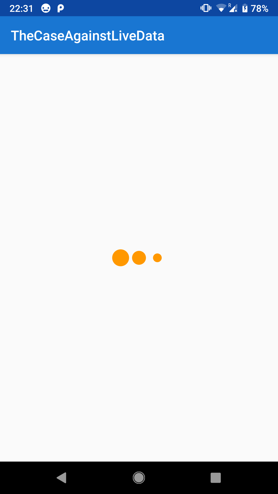
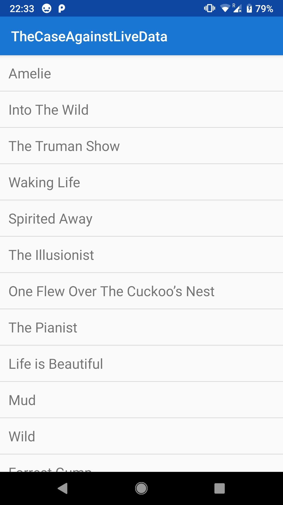
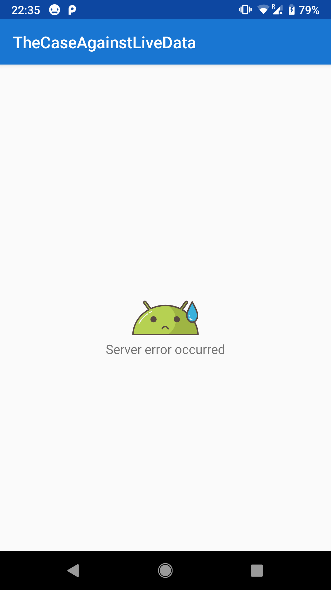

# Lifecycle Aware Presenter
This repo serves as an example for my article [Lifecycle aware Presenter instead of LiveData](https://medium.com/p/f77d640115ef)

In addition in this project I have also used a couple of ideas like: 
* [autoClear()](https://thuytrinh.github.io/rxjava/android/2018/06/26/utility-auto-clear.html) to avoid writing boilerprate code for disposing RxJava disposables in Presenters   
* `@OpenForTesting` annotation with [kotlin-allopen](https://kotlinlang.org/docs/reference/compiler-plugins.html) to enable mocking kotlin classes during tests
* Passing `Provider<T>` in ViewModelFactories, so that instances of `T` for ViewModels are created only once, regardless of configuration changes
* All standard libraries: [Architecture Components](https://developer.android.com/topic/libraries/architecture/), [Dagger 2](https://google.github.io/dagger/), [RxJava 2](https://github.com/ReactiveX/RxJava), [Retrofit](https://square.github.io/retrofit/), [Mockito](https://site.mockito.org/) and.. [AVLoadingIndicatorView](https://github.com/81813780/AVLoadingIndicatorView) (for fancy Progressbar)

Suggestions and comments are very welcome!

# Screenshots
      

# License
```
   Copyright 2018 Baran Michał

   Licensed under the Apache License, Version 2.0 (the "License");
   you may not use this file except in compliance with the License.
   You may obtain a copy of the License at

       http://www.apache.org/licenses/LICENSE-2.0

   Unless required by applicable law or agreed to in writing, software
   distributed under the License is distributed on an "AS IS" BASIS,
   WITHOUT WARRANTIES OR CONDITIONS OF ANY KIND, either express or implied.
   See the License for the specific language governing permissions and
   limitations under the License.
```
